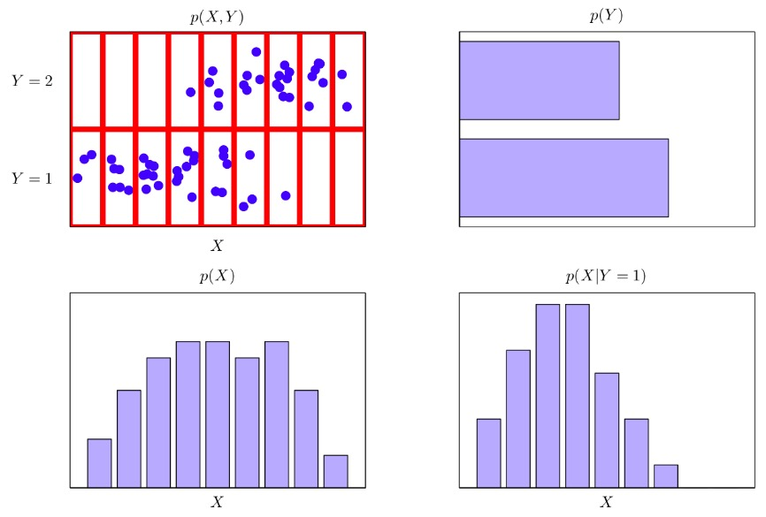
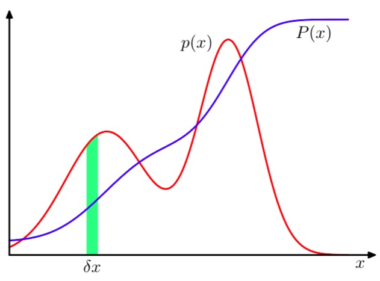
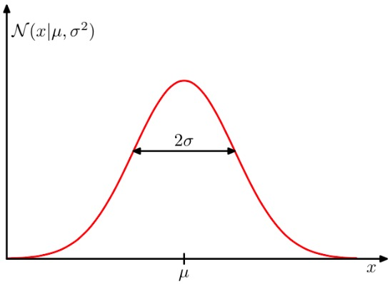
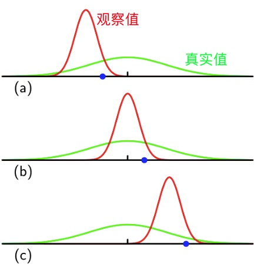
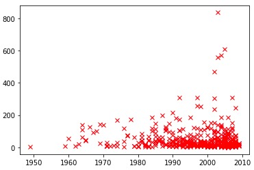
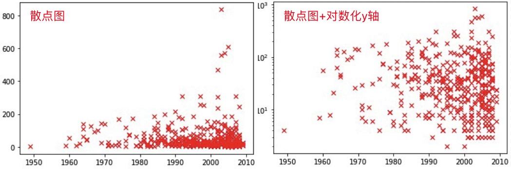
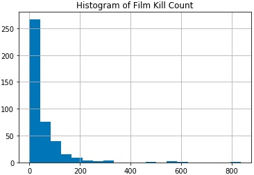

[[toc]]
# Introduction to Machine Learning and Probability
## I. Course Book
1. Simon Rogers and Mark Girolami, **A First Course in Machine Learning**, Chapman and Hall/CRC Press, 2nd Edition, 2016
2. Christopher Bishop, **Pattern Recognition and Machine Learning**, Springer-Verlag, 2006

## II. Basic Definition
### 1. Introduction
|                 类别                  |      种类      |           例子           |
| :-----------------------------------: | :------------: | :----------------------: |
|              Supervised               | Classification | Tumor: malignant? begin? |
|              Supervised               |   Regression   | House Price: \$100~\$200 |
| Unsupervised (offer $X$, without $y$) |   Clustering   |         K-means          |
### 2. Model
* Linaer Model: $y = w_1x+w_0$
* Objective Function: Calculate the error between every point.
$$
\begin{align*}
E(w_0,w_1) &= \sum_{i=1}^{N}(y_i - f(x_i))^2\\
           &= \sum_{i=1}^{N}(y_i - (w_1x+w_0))^2
\end{align*}
$$
* Aim: Estimate the parameters $w_0$ and $w_1$, which <u>best fit the data</u> (lowest error).
$$
\theta = \text{argmin } E(w_0,w_1)
$$
## III. Probability
### 1. Important Formula
#### Basic
|       名字       |       解释        |                   公式                    |
| :--------------: | :---------------: | :---------------------------------------: |
|    Joint Prob    |    $X$ and $Y$    |    $p(X=x_i,Y = y_i) = \frac{n_ij}{N}$    |
|  Marginal Prob   | Regardless of $Y$ | $p(X=x_i) = \sum_{i=1}^{L}p(X=x_i,Y=y_i)$ |
| Conditional Prob |  Under $X = x_i$  |   $p(Y = y_i|X=x_i) = \frac{n_ij}{c_i}$   |

* Marginal Probability is the calulation of Joint Probability (视作投影)


#### Two Rules
1. Sum Rule: $p(X) = \sum_{Y}^{}p(X,Y)$
2. Product Rule: $p(X,Y)=p(Y|X)p(X)$
#### Independent
If
$$
p(X,Y) = p(X)p(Y)
$$
then $X$ and $Y$ are said to be Independent.
#### Bayes' Rule
$$
p(Y|X) = \frac{p(X|Y)p(Y)}{p(X)}
$$

> Normalization(归一化)，可以将分母视作归一化操作：
>
> $$\begin{align*}
> p(Y|X) &= \frac{p(X|Y)p(Y)}{p(X)}\\
> &=\frac{p(X|Y)p(Y)}{\sum_{L}^{}p(X|Y)p(Y)}
> \end{align*}$$
> 此时分母 $p(X) = \sum_{L}^{}p(X|Y)p(Y)$ 只是为了确保 $p(Y|X)\leqslant 1$

### 2. Probability Density
#### Definition
$$
p(x \in (a,b)) = \int_{b}^{a}p(x)dx
$$
indecate the probability that $x$ will lie in an interval $(a,b)$.

Here, $p(x)$ is **probability density**.
> 
> The probability of $x$ lying in the interval $(x,x+\delta x)$

$$
P(z) = \int_{-\infty}^{z}p(x)dx
$$
The probability that x lies in the interval $(-\infty,z)$.
> 注意区分 $P(x)$ 与 $p(x)$，前者是概率，后者是概率密度。

#### Conditions
$$
p(x) \geqslant  0
$$
$$
\int_{-\infty }^{\infty }p(x)dx = 1
$$
### 3. Expectation
> 在概率分布 $p(x)$ 下，某个函数 $f(x)$ 的平均值，即为期望，用 $E[f]$ 表示

| 类别 | 例子 |
| :---------: | :--------------------------: |
|  Discrete   | $E[f] = \sum_{x}^{}p(x)f(x)$ |
| Continuous  |   $E[f] = \int p(x)f(x)dx$   |
| 2-Dimention |        $E_x[f(x,y)]$         |
| Conditional | $E_x[f|y] = \sum_{x}^{}p(x|y)f(x)$ |

### 4. Convariance
#### Normal
$$var[f] = E[(f(x) - E[f(x)])^2]$$
or
$$var[f] = E[f(x)^2] - E[f(x)]^2$$

For example, $var[x] = E[x^2] - E[x]^2$
#### 2 variables
$$
\begin{align*}
cov[x,y] &= E_{x,y}[\{x - E[x]\}\{y - E[y]\}]\\
&= E_{x,y}[xy] - E[x]E[y]
\end{align*}
$$
#### 2 vectors
$$
\begin{align*}
cov[x,y] &= E_{x,y}[\{x - E[x]\}\{y^T - E[y^T]\}]\\
&= E_{x,y}[xy^T] - E[x]E[y^T]
\end{align*}
$$
## IV. Gaussian Distribution
### 1. Definition
#### Normal
$$
\begin{align*}
p(y| \mu, \sigma^2) & = \frac{1}{\sqrt{2\pi\sigma^2}}\exp\left(-\frac{(y - \mu)^2}{2\sigma^2}\right)\\
                    & \buildrel\triangle\over = \mathcal{N}(y|\mu, \sigma^2)
\end{align*}
$$
where $\mu$ is the mean, $\sigma^2$ is the variance, $\sigma$ is the standard deviation, $\beta = \frac{1}{\sigma^2}$ is the precision.

> Gaussian is Normalized（标准正太分布）
> 众数与均值相同
$$
\int_{-\infty}^{\infty}\mathcal{N}(x|\mu,\sigma^2)dx = 1
$$
#### D-Dimention
$$
\mathcal{N}(x|\mu,\Sigma) = \frac{1}{(2\pi)^{D/2}}\frac{1}{|\Sigma|^{1/2}}exp\{-\frac{1}{2}(x-\mu)^T\Sigma^{-1}(x-\mu)\}
$$
### 2. Expectation & Convariance
$$
E[x] = \int_{-\infty}^{\infty}\mathcal{N}(x|\mu,\sigma^2)xdx = \mu
$$
$$
E[x] = \int_{-\infty}^{\infty}\mathcal{N}(x|\mu,\sigma^2)x^2dx = \mu^2 + \sigma^2
$$
$$
var[x] = E[x^2] - E[x]^2 = \sigma^2
$$
### 3. Parameter Estimation
#### Situation
* A data set of observations: $\mathbf{x} = (x_1,...,x_N)^T$
* Data points are **iid** (*independent* and *identically distributed*)
#### Probability of the data set
Given $\mu$ and $\sigma^2$
$$
p(\mathbf{x}|\mu,\sigma^2) = \prod_{n=1}^{N}\mathcal{N}(x_n|\mu,\sigma^2)
$$
> Here $x$ is variable. However, when treat $\mu$ and $\sigma^2$ as variables, it becomes the likelihood function for the Gaussian.

**Consider:** Maximize $p(\mu,\sigma^2|\mathbf{x})$ is more reasonable than $p(\mathbf{x}|\mu,\sigma^2)$.
#### Estimated Expectation & Convariance
Use $ln()$ for convenience,
$$
\text{ln}(p(\mathbf{x}|\mu,\sigma^2)) = -\frac{1}{2\sigma^2}\sum_{n=1}^{N}(x_n-\mu)^2 - \frac{N}{2}\text{ln}\sigma^2 - \frac{N}{2}\text{ln}(2\pi)
$$
To maximize this formula, partial derivative of the parameters here.
$$
\mu_{ML} = \frac{1}{N}\sum_{n=1}^{N}x_n\\
\sigma_{ML}^2 = \frac{1}{N}\sum_{n=1}^{N}(x_n - \mu_{ML})^2
$$
#### Biased
$$
E[\mu_{ML}] = \mu\\
E[\sigma_{ML}^2] = (\frac{N-1}{N})\sigma^2
$$
Thus, the variance is biased estimation. And the true variance shuold be
$$
\tilde{\sigma}^2 = \frac{N}{N-1}\sigma_{ML}^2 = \frac{1}{N-1}\sum_{n=1}^{N}(x_n - \mu_{ML})^2
$$
**Why?**

The reason why it is biased is because it measured relative to the sample mean instead of the true mean.



## V. Lab
### 1. Load Data
```python
import pandas as pd
film_deaths = pd.read_csv('./R-vs-Python-master/Deadliest movies scrape/code/film-death-counts-Python.csv')
```
### 2. Sellect Data
```python
film_deaths[film_deaths['Body_Count']>200]
```
* `film_deaths['Body_Count']>200` returns a **series** of `True` or `False`.
> 排序
> ```Python
> film_deaths[film_deaths['Body_Count']>200].sort_values('Body_Count', ascending=False)
> ```
> `ascending=False`为降序

### 3. Plot the Data
#### Import packages
```Python
%matplotlib inline
import pylab as plt
```
* `%matplotlib inline` ensures the plot appears in the web browser
#### Scatter Plot
```Python
plt.plot(film_deaths['Year'], film_deaths['Body_Count'], 'rx')
```

> Set y values to `log`
> ```Python
> plt.plot(film_deaths['Year'], film_deaths['Body_Count'], 'rx')
> ax = plt.gca()
> ax.set_yscale('log')
> ```
> * 使用对数能减少数据尺度上的差异
> 
#### Histogram
```python
film_deaths['Body_Count'].hist(bins=20)
plt.title('Histogram of Film Kill Count')
```

### 4. Probability
#### Marginal Probability
Compute the approximate probability that a film from the movie body count website has over 40 deaths.
```Python
deaths = (film_deaths.Body_Count>40).sum()
total_films = film_deaths.Body_Count.count()
prob_death = float(deaths)/float(total_films)
print("Probability of deaths being greather than 40 is:", prob_death)
```
* `.sum()` only takes `True` values into a count.
* `count()` calculates all the `True` and `False` values.
#### Jointed Probability
The probability that the number of deaths was over 40 and the year was 2002.
```Python
deaths = (film_deaths.Body_Count[film_deaths.Year==2000]>40).sum()
total_films = film_deaths.Body_Count.count() # this is total number of films
prob_death = deaths/total_films
print("Probability of deaths being greather than 40 and year being", year, "is:", prob_death)
```
下述代码作用相同：
* `film_deaths.Body_Count[film_deaths.Year==2000]>40`
* `film_deaths[film_deaths.Year==2000].Body_Count>40`

#### Conditional Probability
What's the probability that a film has over 40 deaths given that it was made in 2002?
```Python
p_y_given_t = (film_deaths.Body_Count[film_deaths.Year==2002]>40).sum()/(film_deaths.Year==2002).sum()
```
