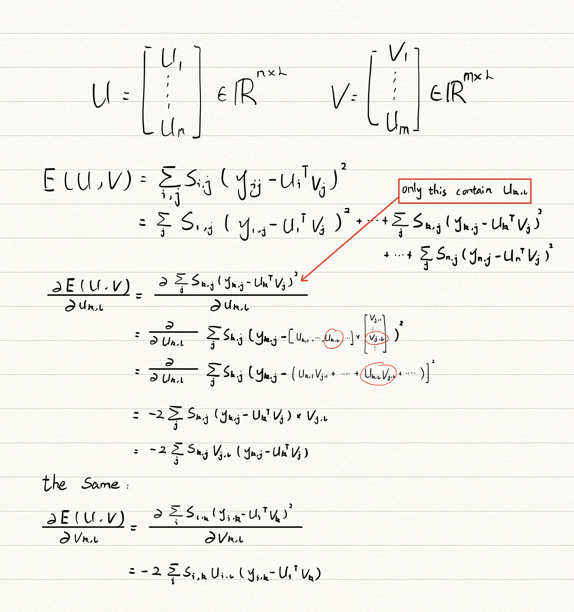

[[toc]]
# Objective Function and Supervised Learning
## I. Classification
### 1. Premise
* Features: $\mathbf{x}_i$ for the $i$th data point
* Labels: $y_i$ is either $-1$ or $+1$
### 2.Prediction Function
For classification,
* Prediction Function:
$$
f(\mathbf{x}_i) = \text{sign}(\mathbf{w}^T\mathbf{x}_i+b)
$$
* Activative Function:
$$
g(z)=\text{sign}(x)=
\left\{\begin{matrix}
+1 & z>0\\
-1 &  z<0
\end{matrix}\right.
$$
### 3. Decision Boundary
It is a **plane** that distinguishes between different classes, such as -1 and +1.
* Equation:
$$
\mathbf{w}^T\mathbf{x}+b=0
$$
> In the current situation,
> $$
> w_1x_{i,1}+w_2x_{i,2}+b=0
> $$

> 二维空间中，决策边界是一条线；三维空间中，它是一个平面，称为超平面（Hyperplane）.

### 4. Perception Algorithm
#### Process
1. If the vector $\mathbf{x}_i$ is **correctly** classified, **change nothing**.

2. If it is **incorrectly** classified,
   * $\mathbf{x}_i$ is **positive**, and incorrectly classified as **negative**,
   $$
   \mathbf{w}_\text{new} = \mathbf{w}_\text{old} + \eta\mathbf{x}_i\\
   b_\text{new} = b_\text{old} + \eta
   $$
   * $\mathbf{x}_i$ is **negative**, and incorrectly classified as **positive**,
   $$
   \mathbf{w}_\text{new} = \mathbf{w}_\text{old} - \eta\mathbf{x}_i\\
   b_\text{new} = b_\text{old} - \eta
   $$
#### Why it works?
Point $\mathbf{x}_i$ has label $y_i=+1$, but incorrectly classified as $-1$.
$$
f(\mathbf{x}_i) = \text{sign}(\mathbf{w}^T\mathbf{x}_i+b) = -1
$$
We have
$$
\mathbf{w}^T\mathbf{x}_i+b < 0
$$

Then according to the process,
$$
\mathbf{w}_\text{new} = \mathbf{w} + \eta\mathbf{x}_i\\
b_\text{new} = b + \eta
$$
After the process,
$$
\begin{align*}
f(\mathbf{x}_i) &= \text{sign}(\mathbf{w}_\text{new}^T\mathbf{x}_i+b_\text{new})\\
&=\text{sign}((\mathbf{w} + \eta\mathbf{x}_i)^T\mathbf{x}_i+(b+\eta))\\
&=\text{sign}(\mathbf{w}^T\mathbf{x}_i+b+\eta\mathbf{x}_i^T\mathbf{x}_i+\eta)
\end{align*}
$$
where $\eta\mathbf{x}_i^T\mathbf{x}_i+\eta$ (positive) pushes $\text{sign}(\cdot)$ to be posotive.
## II. Regression
### 1. Premise
* Features: $\mathbf{x}_i$ for the $i$th data point
* Labels: $y_i$ match $y_i=m\mathbf{x}_i+c+\varepsilon$
### 2. Steepest Descent
1. Initialize with a guess for $m$ and $c$.
2. Offset Gradient:
$$
\frac{\text{d}E(m,c)}{\text{d}c} = -2 \sum_{i=1}^{n}(y_i-m\mathbf{x}_i-c)
$$
3. Slope Gradient:
$$
\frac{\text{d}E(m,c)}{\text{d}m} = -2 \sum_{i=1}^{n}\mathbf{x}_i(y_i-m\mathbf{x}_i-c)
$$
### 3. Stochastic Gradient Descent Algorithm
#### Process
Update the guess parameters by subtracting the gradient from the guess.
$$
c_{\text{new}} = c_{\text{old}} - \eta\frac{\text{d}E(m,c)}{\text{d}c}\\
m_{\text{new}} = m_{\text{old}} - \eta\frac{\text{d}E(m,c)}{\text{d}m}\\
$$
Each time, only take a *small* step by using learning rate ($\eta$), otherwise we might overshoot the minimum.
#### The Meaning of Stochastic
We present each data point in a random order, and process one point a time.
> 打乱数据集，然后顺序抽取。
>
> 但实际上应该，在SGD在每次迭代时，从整个数据集中随机选择一个数据点，这样极大的减少了计算量。

Since the data is normally presented in a random order,
$$
m_{\text{new}} = m_{\text{old}} +2\eta[x_i(y_i-m_{\text{old}}x_i-c_{\text{old}})]
$$
## III. Loss Function
### 1. Definition
Loss function measures how the gap between the model and the real true.

|         名字          |                          公式                          |
| :-------------------: | :----------------------------------------------------: |
| Squared loss function |  $L_n(t_n,f(x_n;w_o,w_1)) = (t_n - f(x_n;w_o,w_1))^2$  |
| Average loss function | $L = \frac{1}{N}\sum_{n=1}^{N}L_n(t_n,f(x_n;w_o,w_1))$ |

More generally,
$$
L = \frac{1}{N}\sum_{n=1}^{N}(t_n - \mathbf{w}^T\mathbf{x}_n)^2
$$
### 2. Aim
$$
\underset{w_0,w_1} {\text{argmin}}\frac{1}{N}\sum_{n=1}^{N}L_n(t_n,f(x_n;w_o,w_1))
$$
or
$$
\underset{w_0,w_1} {\text{argmin}}\frac{1}{N}\sum_{n=1}^{N}(t_n - \mathbf{w}^T\mathbf{x}_n)^2
$$
### 3. Turning Points
The point touch the minima.
* Set the gradient of the loss function to 0.
$$
\frac{\delta f(w)}{\delta w} = 0
$$
For example,
$$
\frac{\partial L}{\partial \mathbf{w}} = \frac{2}{N}\mathbf{x}^T\mathbf{x}\mathbf{w} - \frac{2}{N}\mathbf{x}^T\mathbf{t} = 0 \\
\widehat{\mathbf{w}} = (\mathbf{x}^T\mathbf{x})^{-1}\mathbf{x}^T\mathbf{t}
$$
## IV. Lab
Aim to build a simple movie recommender system.

### 1. Datasets
#### `Y_with_NaNs`
列坐标(`1,2,3,...`)表示`movieId`，行坐标(`102,74,532,...`)表示`userId`

|       |  102 |   74 |  532 |   28 |  274 |  545 |   86 |   79 |  498 |  120 |
| ----: | ---: | ---: | ---: | ---: | ---: | ---: | ---: | ---: | ---: | ---: |
|     1 |  NaN |  NaN |  NaN |  NaN |  4.0 |  NaN |  4.0 |  NaN |  NaN |  NaN |
|     2 |  NaN |  NaN |  NaN |  NaN |  3.5 |  NaN |  NaN |  NaN |  NaN |  NaN |
|     3 |  5.0 |  NaN |  NaN |  NaN |  NaN |  NaN |  NaN |  NaN |  NaN |  NaN |
|     5 |  NaN |  NaN |  NaN |  NaN |  NaN |  NaN |  NaN |  NaN |  NaN |  4.0 |
|     6 |  3.0 |  NaN |  5.0 |  3.5 |  4.0 |  NaN |  NaN |  4.0 |  NaN |  NaN |
|   ... |  ... |  ... |  ... |  ... |  ... |  ... |  ... |  ... |  ... |  ... |
| 82459 |  NaN |  NaN |  NaN |  NaN |  4.0 |  NaN |  NaN |  NaN |  NaN |  NaN |
| 85414 |  NaN |  NaN |  NaN |  NaN |  4.5 |  NaN |  NaN |  NaN |  NaN |  NaN |
| 86332 |  NaN |  NaN |  NaN |  NaN |  2.0 |  NaN |  NaN |  NaN |  NaN |  NaN |
| 86911 |  NaN |  NaN |  NaN |  NaN |  4.0 |  NaN |  NaN |  NaN |  NaN |  NaN |
| 95510 |  NaN |  NaN |  NaN |  NaN |  NaN |  NaN |  4.5 |  NaN |  NaN |  NaN |

#### `Y`
|       | userId | movieId | rating | rating_nor |
| ----: | -----: | ------: | -----: | ---------: |
|  4194 |     28 |       6 |    3.5 |   0.154165 |
|  4195 |     28 |      16 |    2.5 |  -0.845835 |
|  4196 |     28 |      21 |    3.0 |  -0.345835 |
|  4197 |     28 |      23 |    1.5 |  -1.845835 |
|  4198 |     28 |      31 |    2.5 |  -0.845835 |
|   ... |    ... |     ... |    ... |        ... |
| 84643 |    545 |   33794 |    3.5 |   0.154165 |
| 84644 |    545 |   49284 |    1.5 |  -1.845835 |
| 84645 |    545 |   58293 |    3.0 |  -0.345835 |
| 84646 |    545 |   63540 |    2.0 |  -1.345835 |
| 84647 |    545 |   63853 |    2.5 |  -0.845835 |

#### `U`
|      |         0 |         1 |
| ---: | --------: | --------: |
|  102 | -0.001575 | -0.000579 |
|   74 |  0.001109 | -0.000358 |
|  532 | -0.000479 |  0.000899 |
|   28 |  0.000184 |  0.000035 |
|  274 |  0.001129 | -0.001098 |
|  545 | -0.000509 |  0.001550 |
|   86 | -0.000216 |  0.000577 |
|   79 |  0.000037 |  0.000554 |
|  498 |  0.002122 | -0.000243 |
|  120 |  0.000195 |  0.000290 |

#### `V`
|       |         0 |         1 |
| ----: | --------: | --------: |
|     1 |  0.000649 | -0.000160 |
|     2 |  0.000057 | -0.000103 |
|     3 |  0.000397 |  0.000354 |
|     5 |  0.000319 | -0.001078 |
|     6 |  0.000381 | -0.000799 |
|   ... |       ... |       ... |
| 82459 | -0.000390 |  0.001570 |
| 85414 |  0.001142 | -0.000431 |
| 86332 |  0.000033 |  0.000150 |
| 86911 |  0.001059 |  0.000220 |
| 95510 |  0.001249 |  0.000647 |
### 2. Steepest Descent Algorithm
#### Objective Function
Use the sum of squares as loss function to measure the gap between prediction and real rating (Only take non-NaNs into acount).

$$
E(\mathbf{U}, \mathbf{V}) = \sum_{i,j} s_{i,j} (y_{i,j} - \mathbf{u}_i^\top \mathbf{v}_j)^2
$$
here $i$ refers to the $i^{\text{th}}$ user, and $j$ refers to the $j^{\text{th}}$ movie.
$$
s_{i,j} = \left\{\begin{matrix}
 1& ,i^{\text{th}} \text{ user rated } j^{\text{th}} \text{ movie}\\
 0& ,i^{\text{th}} \text{ user didn't rate } j^{\text{th}} \text{ movie}
\end{matrix}\right.
$$
Both $\mathbf{U}$ and $\mathbf{V}$ represent the coordinate **2-D positions** in the map. The movies that user $\mathbf{u}_i$ is interested in should be distributed around him.
$$
\mathbf{U} = \begin{bmatrix} \mathbf{u}_1 \dots \mathbf{u}_i \dots \mathbf{u}_n\end{bmatrix}^\top\in\mathbb{R}^{n\times 2}\\
\mathbf{V} = \begin{bmatrix} \mathbf{v}_1 \dots \mathbf{v}_j \dots \mathbf{v}_m\end{bmatrix}^\top\in\mathbb{R}^{m\times 2}
$$
in it,
$$
\mathbf{u}_i = \begin{bmatrix}
\mathbf{u}_{i,1}\\
\mathbf{u}_{i,2}
\end{bmatrix}\\

\mathbf{v}_j = \begin{bmatrix}
\mathbf{v}_{j,1}\\
\mathbf{v}_{j,2}
\end{bmatrix}
$$
The coordinates here are only 2-dimensional space ($L=2$), but the coordinate system can actually be larger to $L$-dimensional space.
$$
\mathbf{u}_i = \begin{bmatrix}
\mathbf{u}_{i,1}\\
\vdots\\
\mathbf{u}_{i,L}
\end{bmatrix}\\

\mathbf{v}_j = \begin{bmatrix}
\mathbf{v}_{j,1}\\
\vdots\\
\mathbf{v}_{j,L}
\end{bmatrix}
$$
#### Objective Optimization
For a parameter $u_{i,j}$ from the matrix $\mathbf{U}$ we would have an update as follows:
$$
u_{k,\ell} \leftarrow u_{k,\ell} - \eta \frac{\text{d} E(\mathbf{U}, \mathbf{V})}{\text{d}u_{k,\ell}}
$$
where $u_{k,l}$ refers to the $k^{\text{th}}$ user, and $l^{\text{th}}$ dimention feature (in $L$-dimensional space).

We can compute the gradient of the objective function with respect to $u_{k,\ell}$ as
$$
\frac{\text{d}E(\mathbf{U}, \mathbf{V})}{\text{d}u_{k,\ell}} = -2 \sum_j s_{k,j}v_{j,\ell}(y_{k, j} - \mathbf{u}_k^\top\mathbf{v}_{j}).
$$
And it is derived from the following draft,

#### Gradient
And then, we can calculate the gradient according to the formular below,
$$
\frac{\text{d}E(\mathbf{U}, \mathbf{V})}{\text{d}u_{k,\ell}} = -2 \sum_j s_{k,j}v_{j,\ell}(y_{k, j} - \mathbf{u}_k^\top\mathbf{v}_{j}).
$$
$$
\frac{\text{d}E(\mathbf{U}, \mathbf{V})}{\text{d}v_{k,\ell}} = -2 \sum_i s_{i,k}u_{i,\ell}(y_{i, k} - \mathbf{u}_i^\top\mathbf{v}_{k}).
$$
```python
def Grad(U, V, Y):
    dU = pd.DataFrame(np.zeros((U.shape)), index=U.index)
    dV = pd.DataFrame(np.zeros((V.shape)), index=V.index)
    loss = 0
    for user, movie, _, rating in iter(Y.values):
        predict = np.dot(U.loc[user], V.loc[movie])
        diff = rating - np.squeeze(predict)
        loss += diff**2
        dU.loc[user] -= 2 * diff * V.loc[movie]
        dV.loc[movie] -= 2 * diff * U.loc[user]
    return loss, dU, dV
```
#### Iteration Process
$$
u_{k,\ell} \leftarrow u_{k,\ell} - \eta \frac{\text{d} E(\mathbf{U}, \mathbf{V})}{\text{d}u_{k,\ell}}
$$
`dU` has the same shape of `U`, `dV` has the same shape of `V`.
```python
iterations = 10
learn_rate = 0.01
for i in range(iterations):
    loss, dU, dV = Grad(U, V, Y)
    #loss, dU, dV = objective_gradient(Y, U, V)
    print("Iteration", i, "MSE: ", loss)
    U -= learn_rate*dU
    V -= learn_rate*dV
```
### 3. Stochastic Gradient Descent
Stochastic gradient descent involves updating separating each gradient update according to each separate observation, rather than summing over them all.
#### Objective Function
$$
E(\mathbf{u}, \mathbf{v}) = (y-\mathbf{u}^T\mathbf{v})^2
$$
#### Objective Optimization
$$
\frac{\text{d}E(\mathbf{u}, \mathbf{v})}{\text{d}\mathbf{u}} = 2(y-\mathbf{u}^T\mathbf{v})\mathbf{v} \\
\frac{\text{d}E(\mathbf{u}, \mathbf{v})}{\text{d}\mathbf{v}} = 2(y-\mathbf{u}^T\mathbf{v})\mathbf{u}
$$
#### Gradient
Unlike the previous algorithm which calculate the whole gradient, SGD only calculates the gradient of present single data.
```python
def SGD_Grad(rating,u,v):
    prediction = np.dot(u,v)
    diff = prediction - rating
    dU = 2*diff*v
    dV = 2*diff*u
    return dU,dV
```
#### Iteration Process
$$
\mathbf{u} \leftarrow \mathbf{u} - \eta \frac{\text{d}E(\mathbf{u}, \mathbf{v})}{\text{d}\mathbf{u}}
$$
`dU` shapes (2,) which refers to $\mathbb{R}^{L\times 1}$. And it is the same with `dV`.
```python
for iter in range(max_iter):
      np.random.shuffle(idx_list)
      for i in idx_list:
          user,movie,_,rating =  Y.loc[i]
          dU,dV = SGD_Grad(rating, U.loc[user], V.loc[movie])
          U.loc[user] -= lr*dU
          V.loc[movie] -= lr*dV
          update_counter += 1
          if update_counter % check_loss == 0:
              loss = ComputeLoss(U, V, Y)
```
### 4. Prediction
Predictions can be made simply taking the inner product between their vectors $\mathbf{u}_i$ and $\mathbf{v}_j$ for a given user, $i$, for a given film, $j$.
```python
predict = np.dot(U.loc[user], V.loc[film]) # vTu
```
