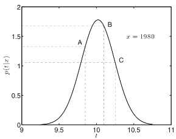

[[toc]]
# Explore Least Squares for Regression
## I. Premise
### 1. Model:
$$y_i = m x_i + c + \epsilon_i$$
* $y_i$ : winning time/pace.
* $x_i$ : year of Olympics.
* $m$ : rate of improvement over time.
* $c$ : winning time at year 0.
* $\epsilon_i$ : random quantity. It's a Gaussian distribution.

  $\epsilon_i \sim  \mathcal{N}(0, \sigma^2)$
### 2. iid Assumption
  * IID代表独立且完全分布式
  * 我们说一组随机变量是IID，如果它们在统计上是独立的，并且每个变量都遵循相同的分布。
  * 请记住，如果一组随机变量的联合分布等于其边际分布的乘积$P(X, Y, Z) = P(X)P(Y)P(Z)$，则它们是统计独立的。
## II. Gaussian Basis
### 1. Gaussian Definition
Probability density:
$$
\begin{align*}
p(y| \mu, \sigma^2) & = \frac{1}{\sqrt{2\pi\sigma^2}}\exp\left(-\frac{(y - \mu)^2}{2\sigma^2}\right)\\
                    & \buildrel\triangle\over = \mathcal{N}(y|\mu, \sigma^2)
\end{align*}
$$
$\sigma^2$ is the variance of the density and $\mu$ is the mean.

### 2. Two Important Rules of Gaussian Distribution
1.  **Sum** of (i.i.d) Gaussian variables is also Gaussian.

    $$y_i \sim \mathcal{N}(\mu_i, \sigma^2_i)$$

    And the sum is distributed as

    $$\sum_{i=1}^{n} y_i \sim \mathcal{N}\left(\sum_{i=1}^n \mu_i,\sum_{i=1}^n \sigma_i^2\right)$$
2.  **Scaling** a Gaussian leads to a Gaussian.

    $$y \sim \mathcal{N}(\mu, \sigma^2)$$

    And the scaled density is distributed as

    $$w y \sim \mathcal{N}(w\mu,w^2 \sigma^2)$$

## III. Likelihood
The original model is
$$y_i = f(\mathbf{x}_i;\mathbf{w})=m x_i + c$$
After add a random variable:
$$y_i = f(\mathbf{x}_i;\mathbf{w}) + \epsilon_i\\
\epsilon_i \sim \mathcal{N}(0,\sigma^2)$$
Now, $y_i$ is a random variable. Thus, we cannot use the loss function to optimize $\mathbf{w}$ and $\sigma^2$.

According to the rule, $y_i$ as a random variable has the density function (**likelihood**)
$$
p(y_i|\mathbf{x}_i,\mathbf{w},\sigma^2) \sim \mathcal{N}(\mathbf{w}^T\mathbf{x}_i,\sigma^2)
$$

> For example, the likelihood function for the year 1980,
>
> 
>
> The most *likely* winning time in 1980 would be 10.02s.
>
> However, the actual time is 10.25s. In order to move 10.02s to actual 10.25s, we can change $\mathbf{w}$ and $\sigma^2$ to find parameters that maximize the likelihood.
>
> * $t = 10.25s$ should be the maximum in the likelihood.

## IV. Datasets Likelihood
Instead of whatch only one data point, we consider the likelihood of the whole datasets.
$$
L=p(\mathbf{y}|\mathbf{X},\mathbf{w},\sigma^2) = \prod_{i=1}^Np(y_i|\mathbf{x}_i,\mathbf{w},\sigma^2) = \prod_{i=1}^N\mathcal{N}(\mathbf{w}^T\mathbf{x}_i,\sigma^2)
$$

## V. Maximum Likelihood
For analytical reasons, use $\log(\cdot)$. Maximize the log-likelihood will also maximize the likelihood.

And we can get an easy expression

$$
\begin{align*}
\log L &= \sum_{i=1}^N\log (p(y_i|\mathbf{x}_i,\mathbf{w},\sigma^2))\\
&= \sum_{i=1}^N\log (\frac{1}{\sqrt{2\pi\sigma^2}}\exp\left\{-\frac{(y_i - f(\mathbf{x}_i;\mathbf{w}))^2}{2\sigma^2}\right\})\\
&= -\frac{N}{2}\log 2\pi -\frac{N}{2}\log \sigma^2 -\frac{1}{2\sigma^2}\sum _{i=1}^{N}\left(y_i-f(\mathbf{x}_i;\mathbf{w})\right)^{2}
\end{align*}
$$
> $\log L$ sometimes is also writen as $L$.
> $$
> L = -\frac{N}{2}\log 2\pi -\frac{N}{2}\log \sigma^2 -\frac{1}{2\sigma^2}\sum _{i=1}^{N}\left(y_i-f(\mathbf{x}_i;\mathbf{w})\right)^{2}
> $$

> Error Function
> * 误差函数的概率解释是负对数似然
> * 最小化误差函数等效于参数的最大似然
> $$
> L(\mathbf{w},\sigma^2) = -\frac{N}{2}\log 2\pi -\frac{N}{2}\log \sigma^2 -\frac{1}{2\sigma^2}\sum _{i=1}^{N}\left(y_i-f(\mathbf{x}_i;\mathbf{w})\right)^{2}\\
> E(\mathbf{w},\sigma^2) = \frac{N}{2}\log 2\pi +\frac{N}{2}\log \sigma^2 +\frac{1}{2\sigma^2}\sum _{i=1}^{N}\left(y_i-f(\mathbf{x}_i;\mathbf{w})\right)^{2}
> $$

Solve for the turning point by setting the derivatives to $0$, the maximum likelihood solution for $\mathbf{w}$:
$$
\widehat{\mathbf{w}} = (\mathbf{X}^T\mathbf{X})^{-1}\mathbf{X}^Ty
$$
It is the same with the previous solution.

The maximum likelihood estimate for $\sigma^2$:
$$
\widehat{\sigma^2} = \frac{1}{N}\sum_{i=1}^N(y_i - \mathbf{x}^T\widehat{\mathbf{w}})^2
$$

the variance is the average squared error.
And can be further simplified by substituting $\widehat{\mathbf{w}} = (\mathbf{X}^T\mathbf{X})^{-1}\mathbf{X}^Ty$, and we can get the solution for $\sigma^2$:
$$
\widehat{\sigma^2} = \frac{1}{N}(y^Ty-y^T\mathbf{X}\widehat{\mathbf{w}})
$$
