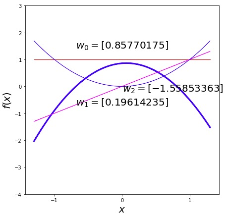
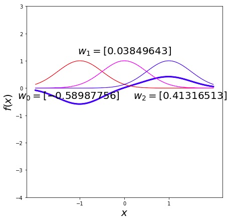

[[toc]]
# Non-Linear Response from A Linear Model
Introduce **basis functions** for non-linear regression models.
## I. Nonlinear Regression
* Problem with Linear Regression: $\mathbf{x}$ may not be linearly related to $\mathbf{y}$

* Solution: create a feature space: define $\phi(\mathbf{x})$ where $\phi(\cdot)$ is a nonlinear function of $\mathbf{x}$.

* Model for target is a linear combination of these nonlinear functions
    $$f(\mathbf{x}) = \sum_{j=0}^m w_j \phi_j(\mathbf{x})$$
### 1. Quadratic Basis
Here, the feature space is
$$\boldsymbol{\phi} = [1, x, x^2]$$
Thus, the model becomes,
$$
\begin{align}
    f(x) &= {\color{\redColor}w_0}\phi_0(x) + {\color{\magentaColor}w_1 \phi_1(x)} + {\color{\blueColor}w_2
                                                                                 \phi_2(x)}\\
         &= {\color{\redColor}w_0} \quad\;\;\;\,+ {\color{\magentaColor}w_1x} \quad\;\,+ {\color{\blueColor}w_2 x^2}
\end{align}
$$
And the result could be,

### 2. Radial Basis Functions
Here, the feature space is
$$\phi_j(x) = \exp\left(-\frac{(x-\mu_j)^2}{2\ell^2}\right)$$
And the model becomes,
$$f(x) = {\color{\redColor}w_0 e^{-2(x+1)^2}}  + {\color{\magentaColor}w_1e^{-2x^2}} + {\color{\blueColor}w_2 e^{-2(x-1)^2}}$$
And the result could be,

## II. Vectorize Nonlinear Regression
The basic definition of functions are

$$f(\mathbf{x}_i) = \mathbf{w}^\top \boldsymbol{\phi}_i$$
$$
\begin{align*}
    \boldsymbol{\phi}_i =
                \begin{bmatrix}
                    \phi_0(\mathbf{x}_i)\\
                    \phi_1(\mathbf{x}_i)\\
                    \vdots\\
                    \phi_m(\mathbf{x}_i)
                \end{bmatrix}.
\end{align*}
$$
We maximize the $\log$ likelihood to get the parameters $\mathbf{w}$ and $\sigma^2$.

And the $\log$ likelihood is
$$
L(\mathbf{w},\sigma^2)= -\frac{n}{2}\log \sigma^2
          -\frac{n}{2}\log 2\pi -\frac{\sum
            _{i=1}^{n}\left(y_i-\mathbf{w}^{\top}\boldsymbol{\phi}_i\right)^{2}}{2\sigma^2}
$$
$$
E(\mathbf{w},\sigma^2)= \frac{n}{2}\log
          \sigma^2 + \frac{\sum
            _{i=1}^{n}\left(y_i-\mathbf{w}^{\top}\boldsymbol{\phi}_i\right)^{2}}{2\sigma^2}
$$
> 误差函数等效于负对数似然，此处忽略常数 $-\frac{n}{2}\log 2\pi$.

After expand the Brackets
$$
\begin{align}
E(\mathbf{w},\sigma^2) &=  \frac{n}{2}\log \sigma^2 + \frac{1}{2\sigma^2}\sum _{i=1}^{n}y_i^{2}-\frac{1}
{\sigma^2}\sum _{i=1}^{n}y_i\mathbf{w}^{\top}\boldsymbol{\phi}_i
+\frac{1}{2\sigma^2}\sum_{i=1}^{n}
\mathbf{w}^{\top}\boldsymbol{\phi}_i\boldsymbol{\phi}_i^{\top}\mathbf{w}\\

&= \frac{n}{2}\log \sigma^2 + \frac{1}{2\sigma^2}\sum _{i=1}^{n}y_i^{2}-\frac{1}{\sigma^2}\mathbf{w}^\top\sum_{i=1}^{n}\boldsymbol{\phi}_i y_i
+\frac{1}{2\sigma^2}\mathbf{w}^{\top}\left[\sum_{i=1}^{n}\boldsymbol{\phi}_i\boldsymbol{\phi}_i^{\top}\right]\mathbf{w}
\end{align}
$$

We calculate the differentiating, and it leads to
$$\mathbf{w}^{*}=\left[\sum _{i=1}^{n}\boldsymbol{\phi}_i\boldsymbol{\phi}_i^{\top}\right]^{-1}\sum _{i=1}^{n}\boldsymbol{\phi}_iy_i = \left(\boldsymbol{\Phi}^\top \boldsymbol{\Phi}\right)^{-1} \boldsymbol{\Phi}^\top \mathbf{y}\\
\left.\sigma^2\right.^{{*}}=\frac{\sum _{i=1}^{n}\left(y_i-\left.\mathbf{w}^{*}\right.^{\top}\boldsymbol{\phi}_i\right)^{2}}{n}
$$
## III. 𝐐𝐑 Decomposition
